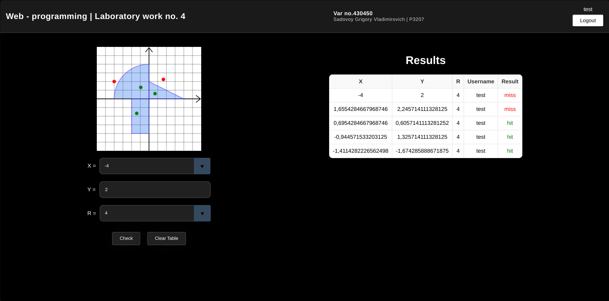
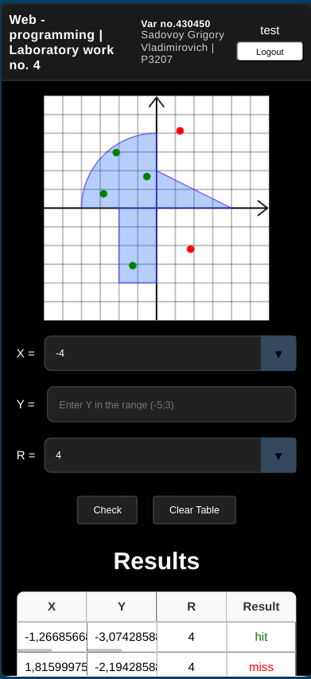

# Лабораторная работа №4: Веб-приложение с использованием Spring и React

## Описание

Эта лабораторная работа представляет собой веб-приложение, состоящее из двух основных частей: бэкенда на основе Spring и фронтенда, разработанного с использованием React и Redux Toolkit. Взаимодействие между фронтендом и бэкендом осуществляется через REST API. Приложение включает две страницы: стартовую и основную. Обе страницы адаптированы для отображения на всех типах экранов.

| PC                           | Mobile                          | 
| ----------------------------------- | ----------------------------------- | 
|  |  |


## Функциональность

### Стартовая страница

- **Шапка**: Содержит ФИО студента, номер группы и номер варианта.
- **Форма входа**: Поля для ввода логина и пароля.
- **Регистрация**: Возможность регистрации новых пользователей.
- **Авторизация**: Вход зарегистрированными пользователями.
- **Хранение данных**: Информация о пользователях хранится в отдельной таблице базы данных, пароли хранятся в виде хеш-сумм.

### Основная страница

- **Доступ**: Доступна только для зарегистрированных пользователей.
- **Ввод данных**: Поле для ввода координат точки.
- **Проверка точки**: Проверка введенной точки на соответствие вхождению в определенную область.
- **График**: Динамически изменяемое изображение, показывающее график и область.
- **Ввод точки**: Точка может быть установлена как по нажатию на график, так и через ввод данных в поля.
- **Список попыток**: Отображение всех попыток проверки точек с координатами (x, y), радиусом, именем пользователя и результатов проверки.
- **Выход**: Кнопка для выхода из текущей сессии и возврата на страницу авторизации.

## Технологии

- **Бэкенд**: Spring Framework
- **Фронтенд**: React, Redux Toolkit
- **База данных**: PostgreSQL
- **ORM**: Spring Data
- **Аутентификация**: Хранение паролей в виде хеш-сумм

## Установка и запуск

# Инструкция по запуску веб-приложения

Для запуска веб-приложения выполните следующие шаги:

1. **Скачайте репозиторий**:
   - Склонируйте репозиторий с помощью Git или скачайте архив с исходным кодом.

2. **Перейдите в корневую папку проекта**:
   - Откройте терминал и перейдите в корневую директорию проекта.

3. **Сборка и запуск проекта**:
   - Выполните команду:
     ```bash
     docker-compose up --build
     ```
   - Эта команда соберет и запустит проект.

4. **Доступ к веб-приложению**:
   - После завершения сборки и запуска, откройте веб-браузер и перейдите по адресу:
     ```
     http://localhost:3000
     ```

## Зависимости

- Spring Boot
- Spring Security
- Spring Data JPA
- PostgreSQL
- React
- Redux Toolkit
- Axios (для HTTP-запросов)

## Заключение

Эта лабораторная работа демонстрирует создание полноценного веб-приложения с использованием современных технологий для бэкенда и фронтенда. Приложение обеспечивает безопасное хранение данных пользователей и предоставляет интерактивный интерфейс для взаимодействия с графиками и данными.